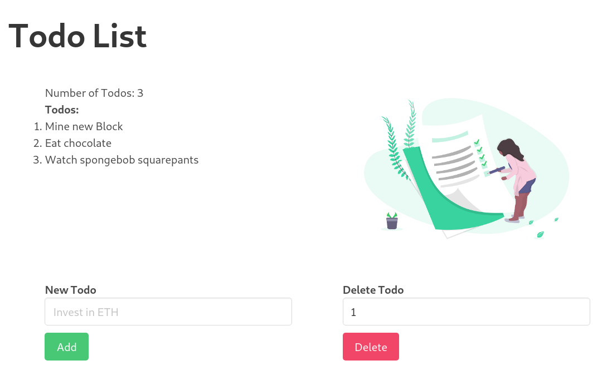
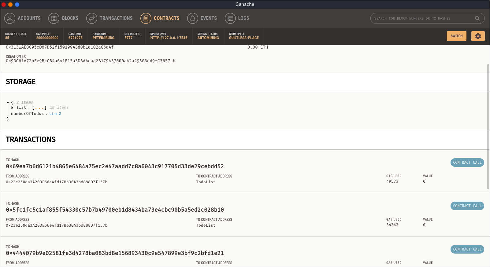

# Todo List Ethereum

A minimal todo list app running on the Ethereum Blockchain.

## Getting Started

These instructions will get you a copy of the project up and running on your local machine for development and testing purposes.

### Prerequisites

- Node
- Truffle (For compiling smart contracts)
- Ganache (Running a local instance of blockchain)

### Installing

1. Clone the repo `$ git clone https://github.com/godcrampy/todo-list-ethereum.git`
2. Install dependencies
   - `$ yarn install`
   - `$ cd client && yarn install`
3. Compile smart contracts `$ truffle compile`
4. Spin up a test blockchain using Ganache or truffle
5. Deploy smart contract `$ truffle migrate`
6. Start client side application `$ cd client && npm start`
   > Note: If you have meta mask installed, disable it or run the client in incognito/private window

## Running the tests

The project uses mocha to test the solidity contracts.

In root directory:
`$ truffle test`

## Built With

- [Truffle](https://www.trufflesuite.com/truffle) - Ethereum framework
- [Ganache](https://www.trufflesuite.com/ganache) - Local Blockchain
- [Drizzle](https://www.trufflesuite.com/drizzle) - Ethereum API
- [Mocha](https://mochajs.org/) - Testing smart contracts
- [React](https://reactjs.org/) - Frontend Framework

## Authors

- **Sahil Bondre** - [godcrampy](https://github.com/godcrampy)

## License

This project is licensed under the MIT License - see the [LICENSE](LICENSE) file for details